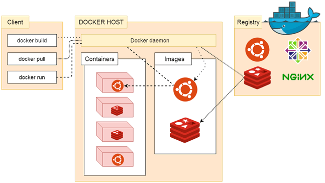

Docker architecture consists of 

* Docker client which is shell
* Docker daemon
* Docker Registry
* Docker objects
    * Images
    * Containers
* Docker networking
* Docker storage

1. Docker works on Client-Server architecture.
2. Docker Client is the shell and Docker daemon(also called as docker host) is the server.
3. Images and Containers are the docker Objects.
4. Docker networking ensures how containers talk to each other.
5. Docker storage takes care of how and where to store the data managed in docker containers.

